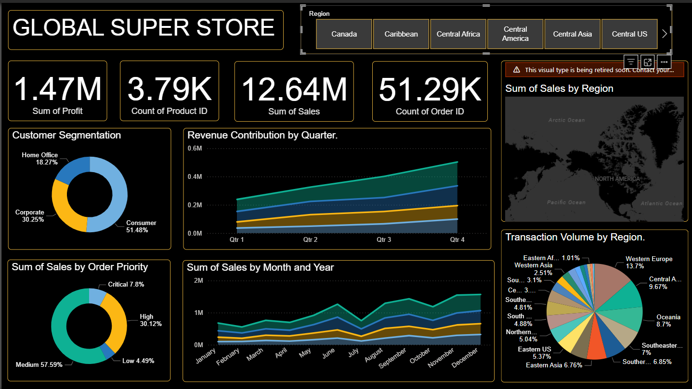

# 📊 Global Superstore Sales Analysis (Power BI)

## 📌 Project Overview
This project analyzes **51k+ orders** from the Global Superstore dataset using **Power BI**.  
The dashboard provides insights into **sales performance, profitability, and customer segmentation**, helping identify key business drivers.

---

## 🔍 Key Insights
- **Customer Segments**:  
  - Consumer segment contributes the most sales (**51%**) compared to Corporate and Home Office.  
- **Profitability**:  
  - 2015 recorded the **highest total profit** (₹5,04,165).  
  - Average profit peaked in 2015 at ₹1,26,041.  
- **Seasonality**:  
  - Q4 2015 contributed **11.45% of annual profit**, showing year-end sales surge.  
- **Regional Trends**:  
  - Sales and profitability vary significantly across regions, highlighting areas for strategy improvement.

---

## 📈 Business Impact
- **Marketing**: Focus campaigns on the **Consumer segment** and boost Q4 promotions.  
- **Forecasting**: Leverage profit trends for future planning.  
- **Operations**: Allocate resources effectively during peak seasons.  

---

## 🛠 Tools & Skills Used
- **Power BI** – Data cleaning, DAX measures, visualization  
- **Excel** – Data source (orders, sales, profit, customer segmentation)  

---

## 📸 Dashboard Preview

---

## 🚀 How to Use
1. Clone this repository.  
2. Open `Global_Superstore_Dashboard.pbix` in **Power BI Desktop**.  
3. Explore the interactive dashboard.  

---

## 👩‍💻 Author
Hemasri Salumuri – *Aspiring Data Analyst*  
